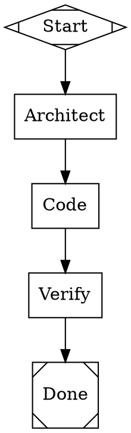
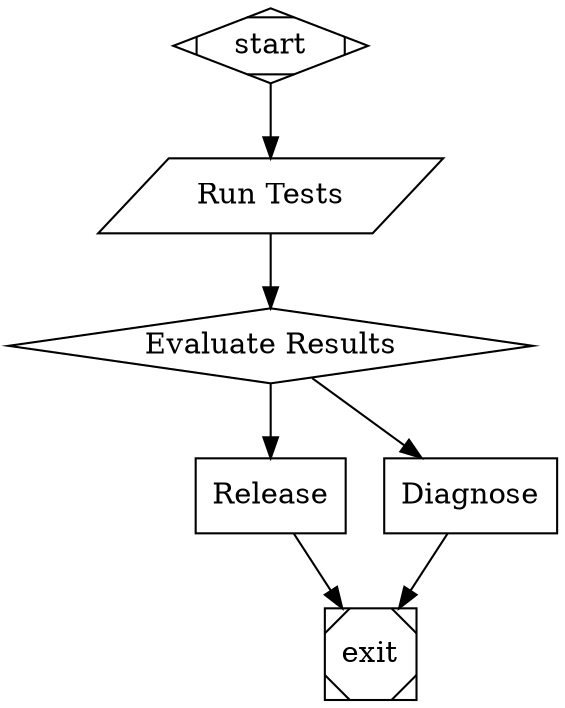
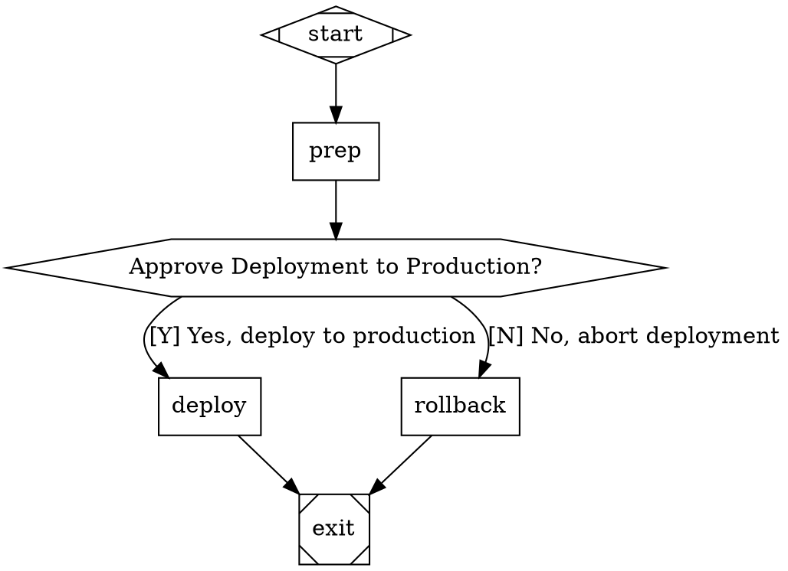
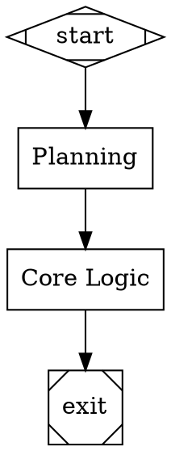
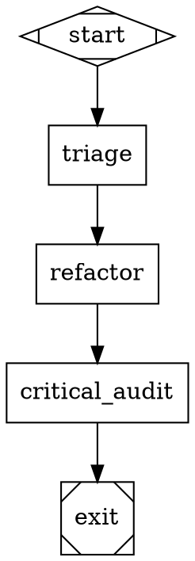

# Strange Lettractor Tutorial: Multi-Stage LLM Workflow Orchestration

Strange Lettractor is a unified agentic framework implementing [StrongDM's Attractor specifications](https://github.com/strongdm/attractor), built in [let-go](https://github.com/nooga/let-go) and managed with [lgx](https://github.com/abogoyavlensky/lgx). This tutorial focuses on its Graphviz DOT workflow layer; unified LLM access and the coding-agent runtime are complementary layers, not limited to DOT workflows. Full specification conformance is still in progress.

---

## 1. Quickstart & Setup

### Environment Configuration

Configure `lgx` to point to your `let-go` runtime:

```bash
export LGX_LG="$HOME/development/let-go/lg"
```

### Build & Verify

```bash
# 1. Run the test suite
lgx test

# 2. Compile the standalone binary
lgx build
# Output: built ./bin/attractor

# 3. View CLI options
./bin/attractor help
```

---

## 2. Core Concepts

### Nodes and Shapes

In Attractor, a node's visual `shape` maps directly to its execution handler:

| Shape | Handler Type | Behavior |
|---|---|---|
| `Mdiamond` | `start` | Pipeline entry point (no-op). Must have no incoming edges. |
| `Msquare` | `exit` | Pipeline terminal point. Evaluates goal gates before allowing exit. |
| `box` | `codergen` | LLM generation / coding task (default handler). |
| `hexagon` | `wait.human` | Pauses execution and prompts for human decision. |
| `diamond` | `conditional` | Routing node whose outgoing edges evaluate guard conditions. |
| `component` | `parallel` | Executes outgoing branches concurrently. |
| `tripleoctagon` | `parallel.fan_in` | Consolidates and ranks candidates from parallel branches. |
| `parallelogram` | `tool` | Executes external shell commands via `tool_command`. |

### Edge Selection Priority (5-Step Algorithm)

When a node completes, Attractor evaluates its outgoing edges in strict order:

1. **Condition Matching**: Edges with non-empty `condition` expressions that evaluate to `true`. Tied by highest `weight`, then target node ID lexicographically.
2. **Preferred Label Match**: Unconditional edges where normalized `label` matches `preferred_label` (strips accelerator prefixes like `[Y] ` or `Y) `).
3. **Suggested Next IDs**: Unconditional edges whose target matches any ID in `suggested_next_ids`.
4. **Highest Weight**: Unconditional edges sorted by `weight` descending (default 0).
5. **Lexical Tiebreak**: Unconditional edges sorted by target node ID ascending.

---

## 3. Practical Tutorials

### Tutorial 1: Linear Pipeline with Variable Expansion

Save as `examples/tutorial_linear.dot`:



#### Inspect and Execute

```bash
# Validate graph structure & lint rules
./bin/attractor validate examples/tutorial_linear.dot

# View the parsed graph summary
./bin/attractor graph examples/tutorial_linear.dot

# Run with simulated or live LLM backend
./bin/attractor run examples/tutorial_linear.dot --auto-approve
```

Each stage writes its artifacts into `attractor_runs/run_<timestamp>/<stage>/`:
- `prompt.md` — The rendered prompt (with `$goal` expanded)
- `response.md` — The LLM output
- `status.json` — Status metadata (`outcome`, `context_updates`, `notes`)

---

### Tutorial 2: Conditional Branching & Tool Execution

Save as `examples/tutorial_branching.dot`:



The tool handler executes the command specified in `tool_command`, writes stdout/stderr to context keys `tool.output` and `tool.error`, and sets `outcome=success` on exit code 0 or `outcome=fail` on non-zero exit codes.

---

### Tutorial 3: Human Approval Gate (`wait.human`)

Save as `examples/tutorial_human.dot`:



#### Running Interactively or Headless:

- **Interactive (Console)**:
  ```bash
  ./bin/attractor run examples/tutorial_human.dot
  ```
  The CLI displays `[Y]` and `[N]` accelerators and waits for terminal input.

- **Automated (Headless)**:
  ```bash
  ./bin/attractor run examples/tutorial_human.dot --auto-approve
  ```
  The auto-approve interviewer selects the first available option.

---

### Tutorial 4: Goal Gates and Automated Retries

Save as `examples/tutorial_goal_gate.dot`:



#### How Goal Gates Operate:
1. `implement` is flagged with `goal_gate=true`.
2. When traversal reaches the terminal `exit` node (`shape=Msquare`), Attractor inspects all goal gate nodes visited.
3. If any goal gate ended in `fail` or `retry`, the engine intercepts termination and immediately jumps to the node's `retry_target` (`plan`), giving the pipeline a chance to self-correct.
4. Once all goal gates satisfy `success` or `partial_success`, the pipeline exits cleanly.

---

### Tutorial 5: Model Stylesheets & LiteLLM Convention (`provider/model`)

Attractor supports the **LiteLLM convention** (`<provider>/<model_name>`), removing the need to specify `llm_provider` separately:



You can also pass this directly via CLI:
```bash
./bin/attractor run pipeline.dot --model openai-compat/deepseek-v4-pro:0813 --auto-approve
```

#### Specificity Resolution Order:
1. **Explicit node attributes** (e.g. `llm_model="custom"`) — *highest precedence*
2. **`#id` rules** (specificity 3) — e.g. `#critical_audit` resolves to `o3-mini` via OpenAI
3. **`.class` rules** (specificity 2) — e.g. `.heavy` resolves to `claude-3-7-sonnet`
4. **`shape` rules** (specificity 1) — e.g. `box` sets `reasoning_effort: medium`
5. **Universal `*` rules** (specificity 0) — e.g. fallback `qwen3.5:397b` via Ollama Cloud

---

### Tutorial 6: Captured Child Workflows

Run the included provider-free example:

```bash
./bin/attractor run examples/composition-parent.dot --logs-root attractor_runs/composition-demo
```

The parent calls `composition-child.dot` through an explicit `type=subpipeline`
node. The path is relative to the containing DOT file. The child runs a tool that
prints `hello-from-child`; this output mapping copies its result back into the
parent's `child.result` context key:

```dot
child [type=subpipeline,
       subpipeline.dotfile="composition-child.dot",
       output_map="{\"tool.output\" \"child.result\"}"];
```

Mappings are quoted EDN map strings inside DOT attributes. `input_map` maps parent
keys to child keys; `output_map` maps child keys to parent keys. For example,
`input_map="{\"request\" \"task\"}"` supplies the parent's existing `request`
value as the child's `task`. Absent maps mean no values are mapped. Inputs are
deep-copied, unmapped parent values are not inherited, and a present `nil` value
is distinct from a missing key. All output keys must exist before any output is
applied. Failed or cancelled children contribute no mapped outputs.

The temporary mapping reader supports ordinary string-to-string maps, comments,
commas, and string escapes. Metadata and reader discards are not yet supported;
see the [Clojure reader compatibility findings](let-go-reader-compatibility.md).
Engine-owned destination keys such as `run.id`, `current_node`, and `graph.*`
cannot be mapped over.

Preparation validates and captures the full recursive workflow before execution.
Each child attempt has its own context and checkpoint beneath
`<parent-run>/<node>/children/<uuid>/` (unusual node IDs use a hashed directory
component). Each run retains the full captured workflow and identifies its own
selected plan. A child checkpoint can therefore be resumed independently.

If the parent is interrupted during a child call, parent resume starts a fresh
child attempt from the capture and preserves the previous attempt's files. It
does not continue the interrupted handler in place: external effects may run
again. Completed child calls are skipped, retaining their mapped outputs.

---

## 4. Checkpoints & Resuming

Attractor writes state to `{logs_root}/checkpoint.edn` after every stage:

```edn
{:timestamp 1788384849015
 :current_node "implement"
 :completed_nodes ["start" "plan" "implement"]
 :node_retries {}
 :node_outcomes {"plan" {:status :success} "implement" {:status :success}}
 :context_values {"graph.goal" "..." "last_stage" "implement"}
 :logs []}
```

To resume execution from a saved checkpoint:

```bash
./bin/attractor resume --checkpoint attractor_runs/run_123/checkpoint.edn
```

Public runs also save an immutable workflow capture. Their checkpoints include
`workflow_fingerprint`, `workflow_manifest`, and `workflow_plan_id` identity
fields. Resume executes the captured plan even if current DOT files change or
disappear, reporting source drift as a warning. Missing or corrupt captured data
stops recovery. The optional DOT argument is a current-source comparison override,
not a replacement execution plan.

---

## 5. HTTP Management Server Mode

Start the experimental HTTP server to inspect runs over REST and submit human-gate answers:

```bash
./bin/attractor serve --port :7070
```

### Core API Endpoints:

| Method | Route | Description |
|---|---|---|
| `POST` | `/pipelines` | Submit a DOT pipeline body and begin background execution. Returns `{"id": "pipe-..."}`. |
| `GET` | `/pipelines` | List all active and completed pipelines. |
| `GET` | `/pipelines/:id` | Get status and progress for a specific pipeline. |
| `GET` | `/pipelines/:id/events` | Retrieve the currently collected events encoded as SSE records. |
| `POST` | `/pipelines/:id/cancel` | Mark a pipeline cancelled. Cooperative execution cancellation is not implemented yet. |
| `GET` | `/pipelines/:id/graph` | Retrieve the pipeline DOT definition. |
| `GET` | `/pipelines/:id/questions` | Poll for pending `wait.human` approval questions. |
| `POST` | `/pipelines/:id/questions/:qid/answer` | Submit an answer to a human interaction question (`{"answer": "Y"}`). |
| `GET` | `/pipelines/:id/checkpoint` | Read the latest checkpoint state. |
| `GET` | `/pipelines/:id/context` | Inspect the current key-value context store. |

---

## 6. Cleanup Commands

Clean all generated stage outputs, run logs, checkpoints, and temporary files:

```bash
# Clean via lgx
lgx clean

# Clean via standalone binary
./bin/attractor clean

# Clean artifacts and remove compiled binary
./bin/attractor clean --all
```
